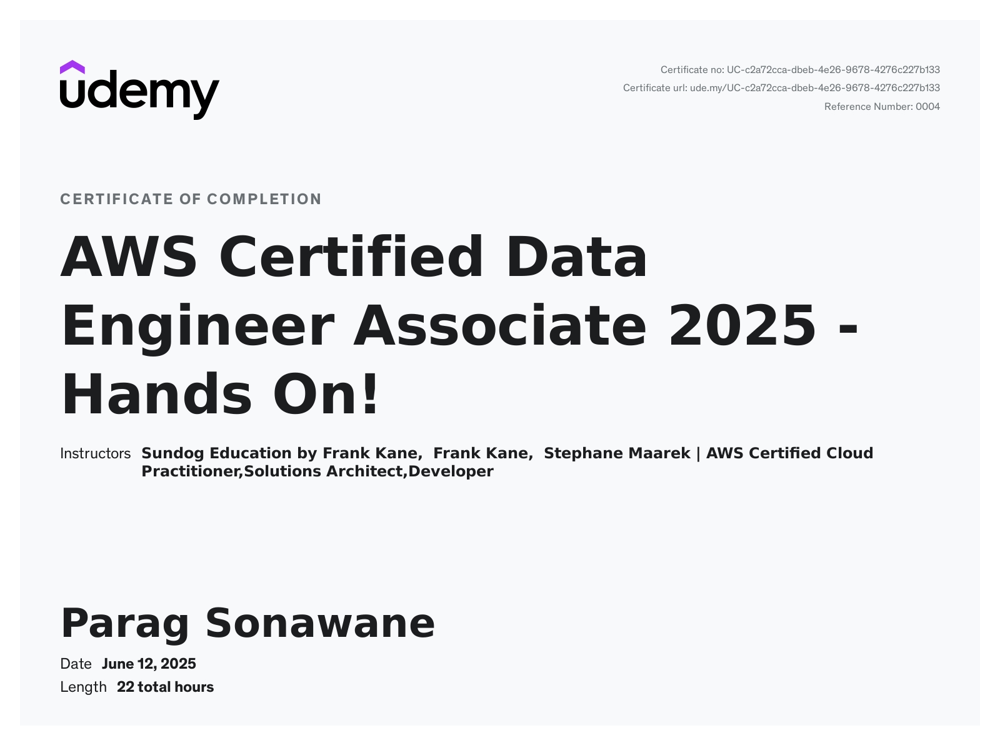
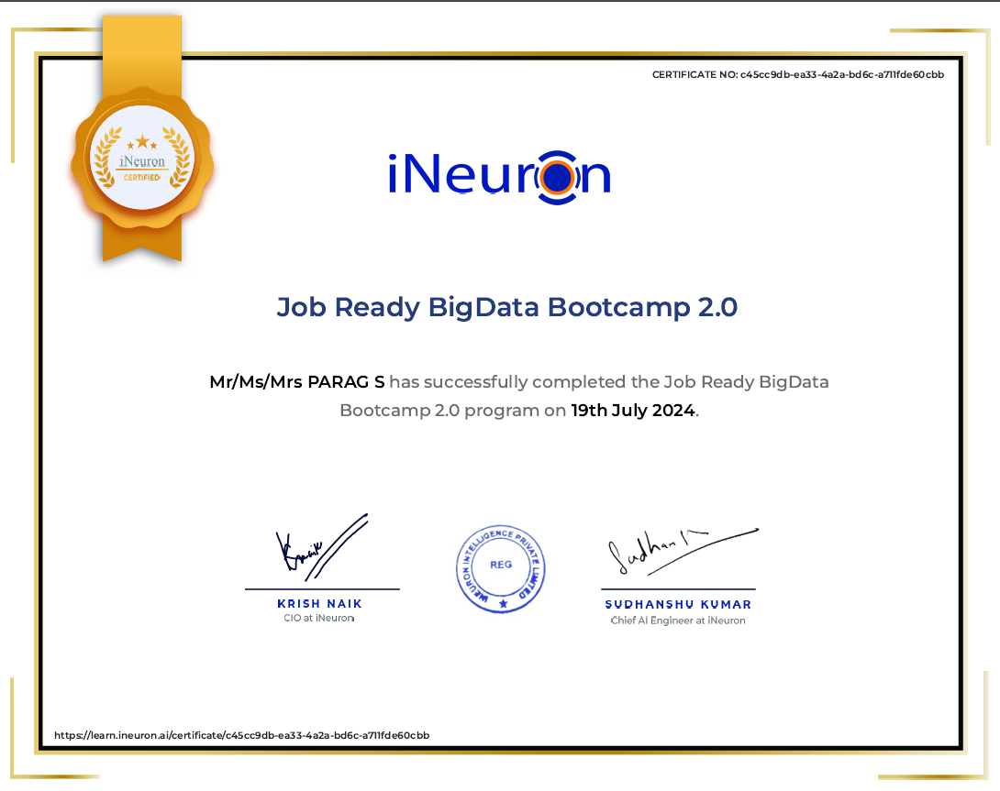
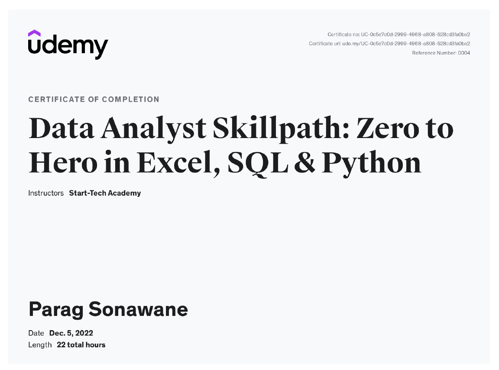
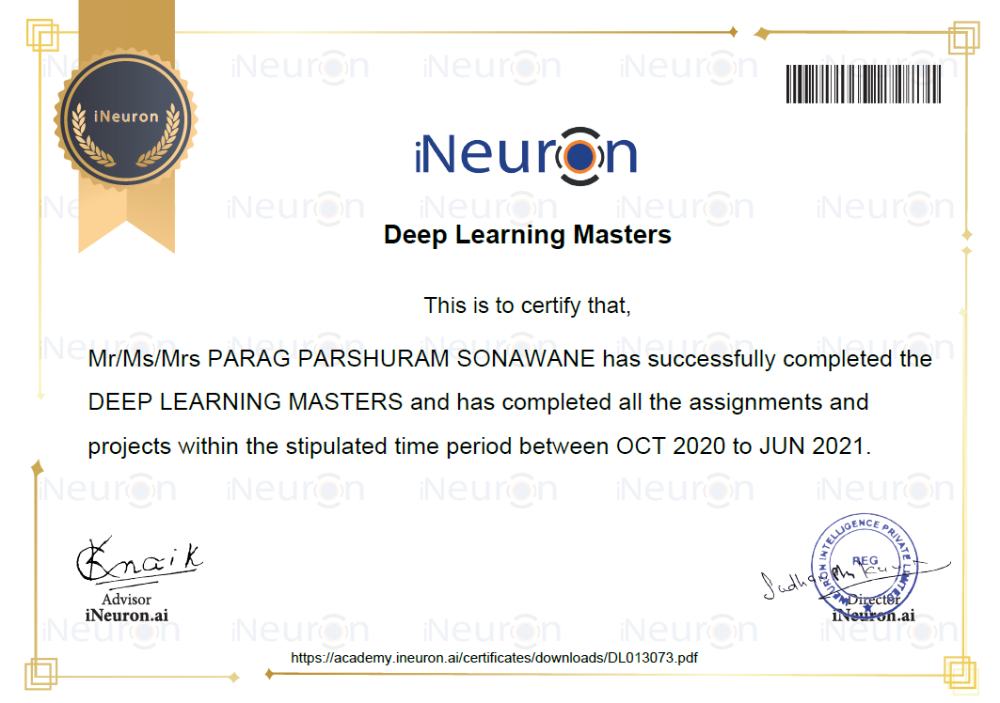
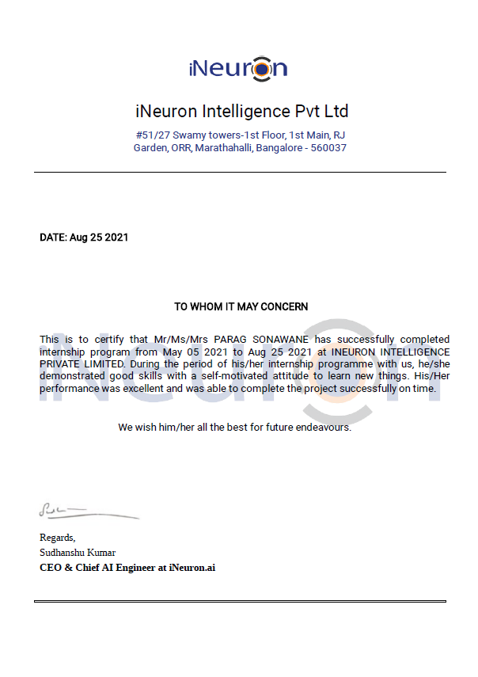
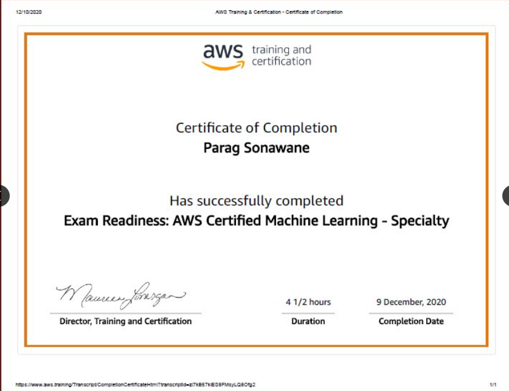
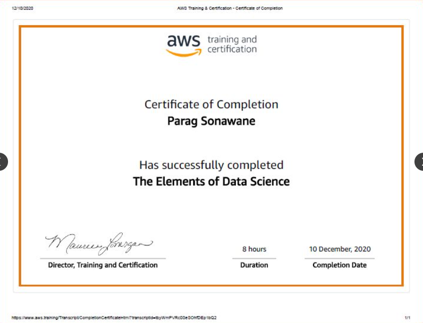
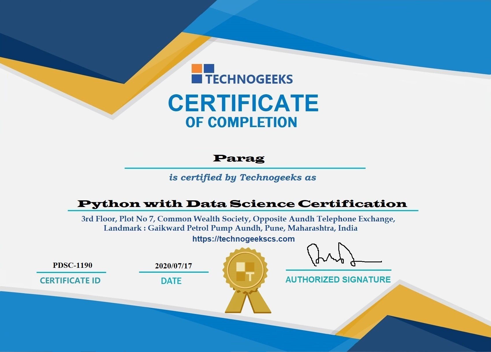

# Professional Certifications & Credentials

Welcome to my verified portfolio of technical certifications. This repository serves as a centralized record of my professional development in Data Engineering, Machine Learning, and Data Analytics.

---

## 📜 Certification Timeline

| Certification Name | Year | Provider |
| :--- | :--- | :--- |
| AWS Certified Data Engineer Associate | 2025 | Udemy |
| Big Data Certification | 2024 | iNeuron |
| Data Analyst (Excel, SQL, Python) | 2022 | Udemy |
| Deep Learning Masters | 2021 | iNeuron |
| Internship Program | 2021 | iNeuron |
| AWS Machine Learning Specialty | 2020 | AWS |
| AWS: The Elements of Data Science | 2020 | AWS |
| Python with Data Science | 2020 | Technogeeks |

---

## 🎓 Verified Credentials

### 1. AWS Certified Data Engineer Associate (2025)

### 2. Big Data Certification (2024)

### 3. Data Analyst (Excel, SQL, Python) (2022)

### 4. Deep Learning Masters (2021)

### 5. Internship Program (iNeuron) (2021)

*View [Offer Letter](assets/2021-05-Ineuron-Internship-Program-Offer-Letter.png)*

### 6. AWS Machine Learning Specialty (2020)

### 7. AWS: The Elements of Data Science (2020)

### 8. Python with Data Science (2020)

---

## 🔗 Connect With Me
* [LinkedIn Profile](https://linkedin.com/in/parag-sonawane-a128231ba/)
* [YouTube - Paraggems Decoder](https://www.youtube.com/channel/UCVrgigVeDiFkBNHbtcLL5iw)

---
